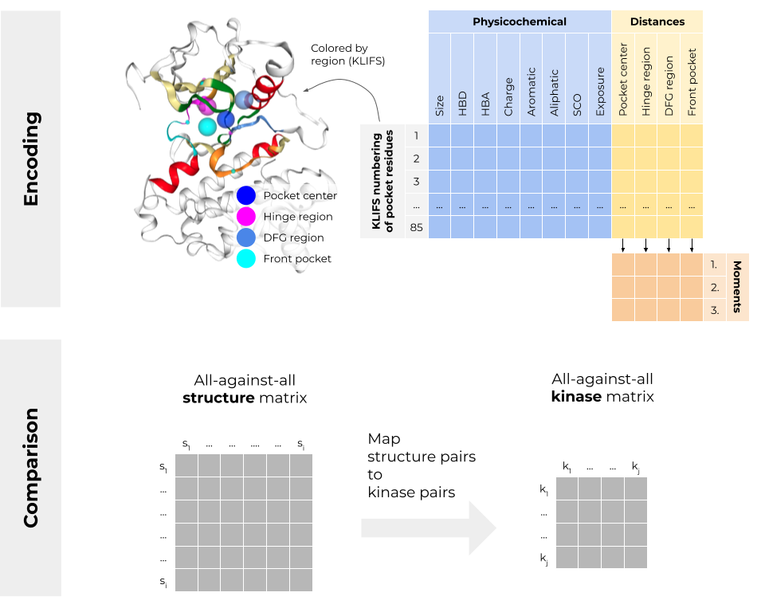

Kinome-wide structural pocket similarity
========================================

> ⚠ This project is work-in-progress.

All-against all comparison of structurally covered kinases using the [`kissim`](https://github.com/volkamerlab/kissim) fingerprint. 

## Project Organization

    ├── LICENSE
    ├── Makefile           <- Makefile with commands like `make data` or `make train`
    ├── README.md          <- The top-level README for developers using this project.
    ├── data
    │   ├── external       <- Data from third party sources.
    │   ├── interim        <- Intermediate data that has been transformed.
    │   ├── processed      <- The final, canonical data sets for modeling.
    │   └── raw            <- The original, immutable data dump.
    │
    ├── docs               <- A default Sphinx project; see sphinx-doc.org for details
    │
    ├── results            <- Encodings (fingerprints) and comparisons
    │
    ├── notebooks          <- Jupyter notebooks. Naming convention is a number (for ordering),
    │                         the creator's initials, and a short `-` delimited description, e.g.
    │                         `1.0-jqp-initial-data-exploration`.
    │
    ├── references         <- Data dictionaries, manuals, and all other explanatory materials.
    │
    ├── reports            <- Generated analysis as HTML, PDF, LaTeX, etc.
    │   └── figures        <- Generated graphics and figures to be used in reporting
    │
    ├── requirements.txt   <- The requirements file for reproducing the analysis environment, e.g.
    │                         generated with `pip freeze > requirements.txt`
    │
    ├── setup.py           <- Makes project pip installable (pip install -e .) so src can be imported
    │
    ├── src                <- Source code for use in this project.
    │   ├── __init__.py    <- Makes src a Python module
    │   ├── data           <- Scripts to download or generate data
    │   ├── encoding       <- Scripts to encode raw data as fingerprints
    │   ├── comparison     <- Scripts to compare fingerprints
    │   ├── pipeline       <- Scripts to encode and compare
    │   └── visualization  <- Scripts to create exploratory and results oriented visualizations
    |
    └── tox.ini            <- tox file with settings for running tox; see tox.readthedocs.io

## Contact

If you have questions or suggestions regarding the notebooks in this repository, please [open an issue here](https://github.com/volkamerlab/kissim_app/issues).

If you have questions or suggestions regarding the `kissim` package, please [open an issue here](https://github.com/volkamerlab/kissim/issues).

We are looking forward to hearing from you!

## License

This work is published under the [MIT license](https://github.com/volkamerlab/kissim/blob/master/LICENSE).

Copyright (c) 2020, Volkamer Lab

## Acknowledgements

### Funding

Volkamer Lab's projects are supported by several public funding sources
(for more info see our [webpage](https://volkamerlab.org/)).

### Collaborators

The `kissim` project is a collaboration between the Volkamer Lab (Dominique Sydow, Eva Aßmann and Andrea Volkamer), Albert Kooistra (University of Copenhagen) and Friedrich Rippmann (Merck).

### External resources

#### Databases/websites

- [KLIFS](https://klifs.net/)
- [KinMap](http://www.kinhub.org/kinmap/)

#### Python packages

See Python packages listed in the [`kissim` repository README](https://github.com/volkamerlab/kissim#python-packages).

#### Repository

<small>Project based on the <a target="_blank" href="https://drivendata.github.io/cookiecutter-data-science/">cookiecutter data science project template</a>. #cookiecutterdatascience</small>

